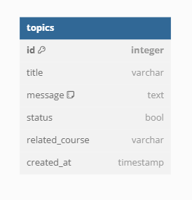

                                          PROJECT DESCRIPTION  
Topic service with basic CRUD operations and autentication whit JWT (Json web token)

                                          PROJECT REQUIREMENTS
- Java JDK: versión 17 en adelante  
- Maven: versión 4 en adelante   
- Spring Boot: versión 3 en adelante | https://start.spring.io/
- MySQL: versión 8 en adelante  
- IDE (Entorno de desarrollo integrado) IntelliJ IDEA

**DEPENDENCIES**
- Spring web
- Spring Devtools
- Spring data Jpa
- Driver PostgreSQL
- Loombok
- Spring Security
- Validation
- Jwt (v. 4.2.0)

                                        ENTITY DIAGRAM 
  